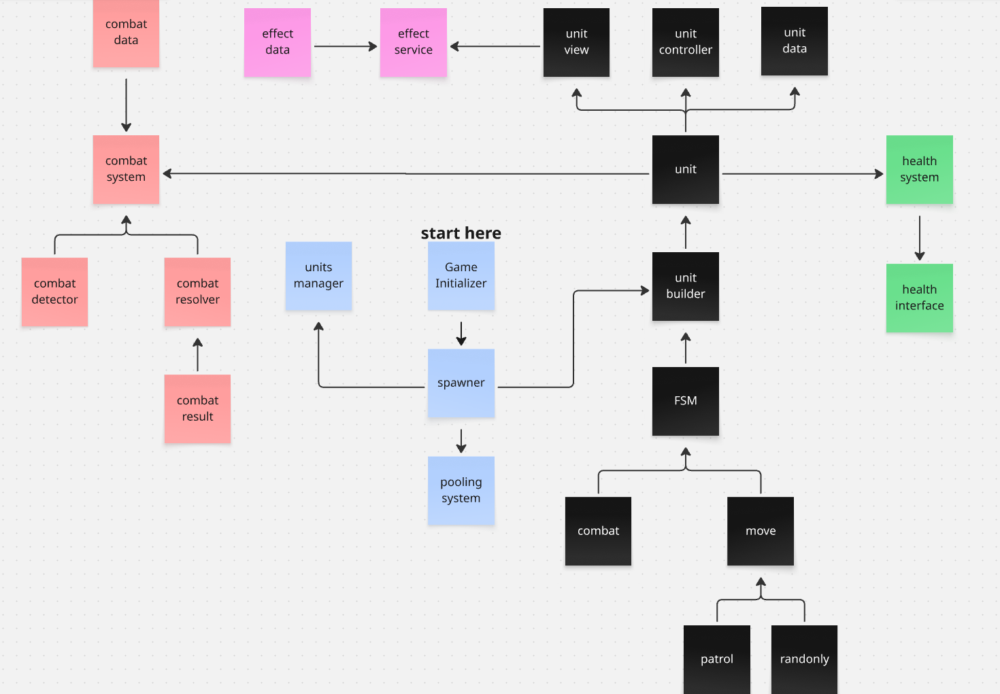
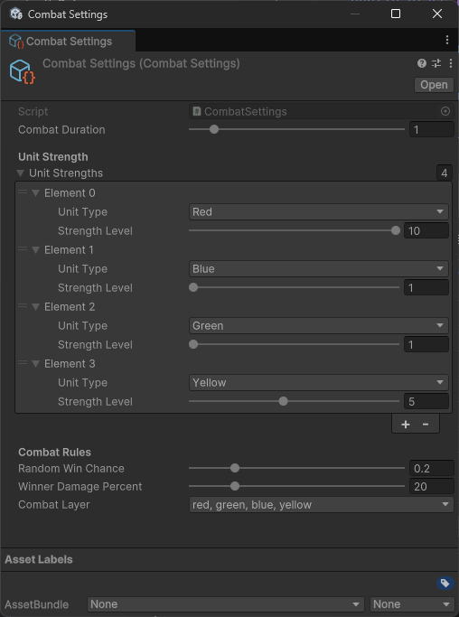
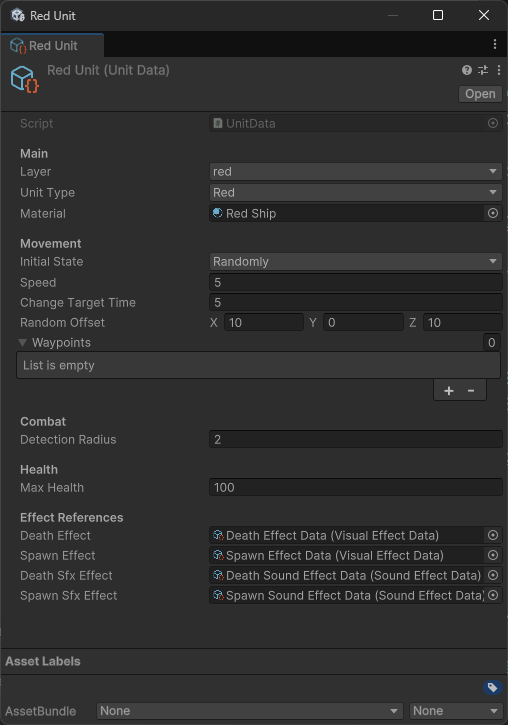
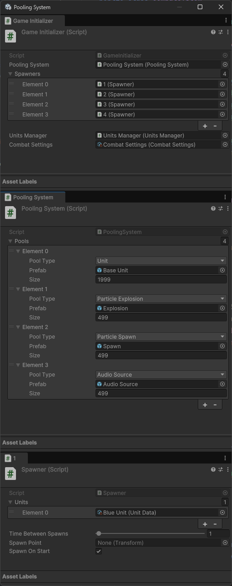
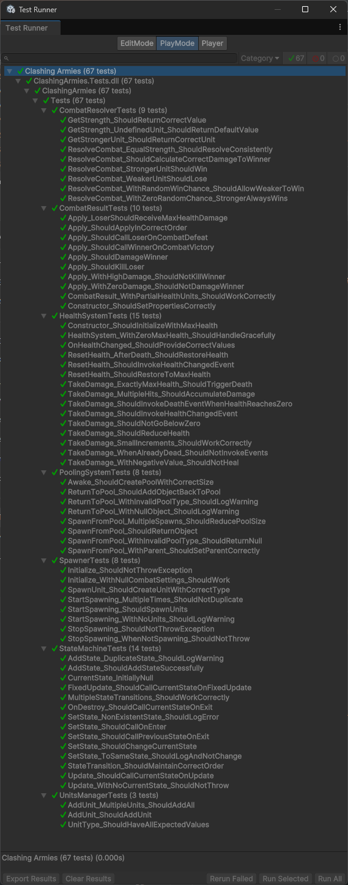

# Clashing Armies

[](https://unity.com/)

Technical evaluation demonstrating scalable systems for a PC strategy game with automatic unit combat.

## Core Behavior

* 4 spawners generating colored units (Red, Green, Blue, Yellow)
* Units patrol or move randomly
* Different colors engage in combat on collision
* Stronger unit survives with reduced health
* Health system with visual feedback

## Architecture

### System Flow



[View interactive diagram on Miro](https://miro.com/app/board/uXjVJ4qPYqI=/?share_link_id=42569797821)

### Design Patterns

| Pattern | Implementation |
|---------|----------------|
| **Pooling** | Zero runtime instantiation |
| **Observer** | Events for health, combat, spawning |
| **State Machine** | PatrolState, RandomMoveState, CombatState |
| **Builder** | Fluent unit construction |
| **MVC** | Unit (Model), UnitView (View), UnitController (Controller) |
| **Strategy** | ICombatResolver interface |

## SOLID Principles

**Single Responsibility**
* Each class has one reason to change (HealthSystem, CombatResolver, EffectsService)

**Open/Closed**
* New states via IState without modifying existing
* New combat rules via ICombatResolver implementations

**Liskov Substitution**
* MoveState abstract base for concrete implementations
* All interfaces substitutable

**Interface Segregation**
* ICombatant, IDamageable, IEnemyDetector split by concern

**Dependency Inversion**
* Depend on abstractions, not concrete classes
* All dependencies injected via constructors

**Inversion of Control**
* Constructor injection throughout
* Components don't control their lifecycle
* Builder pattern for unit assembly

## Configuration

### Combat Settings



### Unit Data



## Scene Configuration (Initial Setup)


## Testing

[]()



* CombatResolverTests (9)
* CombatResultTests (10)
* HealthSystemTests (15)
* StateMachineTests (14)
* PoolingSystemTests (9)
* SpawnerTests (8)
* UnitsManagerTests (3)

## Optimization

* Object Pooling for zero runtime instantiation
* Physics.OverlapSphereNonAlloc for garbage-free detection
* Event-driven architecture for decoupling
* ScriptableObject for memory-efficient data sharing
* Component caching for performance
* Optimized textures and reduced polygon count on models (using Blender) as the original assets from the store were inefficient, thus improving memory usage and rendering performance.
* Level of Detail (LOD) implemented for further memory and CPU efficiency on distant units.

## Development Process

### Thinking Process

1. **Documentation** - Read requirements and identified core systems needed
2. **Architecture** - Designed component interactions and dependencies
3. **Patterns** - Selected design patterns (Pooling, Observer, State Machine, Builder, MVC)
4. **Planning** - Organized implementation order and priorities
5. **Execution** - Implemented core systems following SOLID principles
6. **Refactoring** - Code cleanup and structure improvements
7. **Testing** - Manual and unit tests for validation
8. **Optimization** - Performance improvements and profiling

Steps 5-8 repeat iteratively until completion.

### Implementation Plan

**Phase 1: Base Systems**
* PoolingSystem for object reuse
* UnitsManager for unit tracking
* GameInitializer for dependency injection

**Phase 2: Core Logic**
* Unit system with Builder pattern
* State Machine with PatrolState and RandomMoveState
* Combat system with detection and resolution
* Health system with events

**Phase 3: Polish**
* Visual and audio effects via pooling
* Health bar UI
* Unit tests

**Phase 4: Performance**
* CPU profiling
* Memory analysis
* Optimizations
* Additional unit tests

Time Constraints Impact: Due to limited time, I intentionally deprioritized visual polish and complex features like NavMesh integration. The primary objective of this technical evaluation was to demonstrate solid architecture, scalable systems, clean code, and performance optimization, which required the focus on Phases 1-3 and architecture design (SOLID/Patterns) over visual presentation. 

## AI Assistance

Claude (Anthropic) was used for unit test structure, edge case identification, and code review suggestions. All implementation, architectural decisions, and design choices were made by the developer.

## Project Structure

```
Assets/
├── Materials/
├── Models/
├── Prefabs/
├── Resources/
├── Scenes/
├── Scriptable Objects/
├── Scripts/
│   ├── ClashingArmies/
│   │   ├── Combat/
│   │   ├── Effects/
│   │   ├── FSM/
│   │   ├── Health/
│   │   ├── Units/
│   │   └── Util/
│   └── Tests/
├── Settings/
├── Sounds/
├── Sprites/
├── TextMesh Pro/
├── Textures/
└── Packages/
```

**Unity Version:** 6000.0.34f1